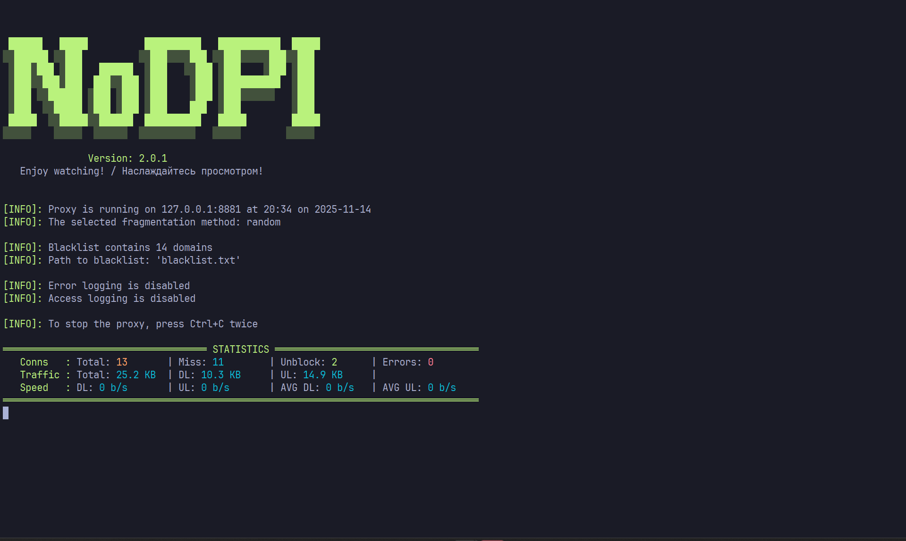

## nodpi

**Читайте на других языках:**
- **[English](README.md)**
- [Русский](README.ru.md)

**nodpi** — это утилита, предназначенная для обхода DPI (Deep Packet Inspection). Является форком [NoDPI](https://github.com/GVCoder09/NoDPI).

**Чем же отличается наша версия:**
1. Взаимодействие с программой через json конфигурацию
2. Разделение файлов (не один `main.py` файл, как в оригинальном репозитории)
3. Добавлен `start.bat` файл для быстрого запуска программы

**Что планируем сделать:**
1. Перерисовать логотип проекта (`.ico` и `.png` формат)
2. Переписать `Dockerfile` для работы с утилитой
3. Написать инструкцию по сборке из исходного кода
4. Написать инструкцию по запуску из исходного кода

<!-- ### Быстрый старт
1. Скачайте последнюю версию для вашей ОС со [страницы релизов](https://github.com/GVCoder09/NoDPI/releases) и распакуйте её.
2. Перейдите в каталог с распакованной утилитой и запустите файл `start.bat` в Windows или `./nodpi -c ./blacklist.txt` в Linux. Вы можете заменить файл `blacklist.txt` своим.
3) В настройках браузера или системы настройте прокси на `127.0.0.1:8881`
4) Наслаждайтесь!

## Запуск из исходного кода
1) Убедитесь, что у вас установлен Python 3.9 или выше. Сторонние библиотеки не требуются.
2) Склонируйте репозиторий `git clone https://github.com/GVCoder09/NoDPI.git` или [скачайте архив](https://github.com/GVCoder09/NoDPI/archive/refs/heads/main.zip) с исходным кодом и распакуйте его.
3) Перейдите в корневой каталог и запустите код командой `python src/main.py`.
4) В настройках браузера или системы установите прокси-сервер на 127.0.0.1:8881.
5) Наслаждайтесь!

Вы можете включить логирование ошибок и доступа с помощью параметров `--log_error` и `--log_access`.

## Сборка исполняемого файла

1) Убедитесь, что у вас установлен Python 3.9 или выше.
2) Установите pyinstaller: `pip install pyinstaller`
3) Клонируйте репозиторий `git clone https://github.com/GVCoder09/NoDPI.git` или [скачайте архив](https://github.com/GVCoder09/NoDPI/archive/refs/heads/main.zip) с исходным кодом и распакуйте его.
4) Перейдите в корневой каталог и выполните команду `pyinstaller ./nodpi.spec`
5) Скомпилированный файл будет находиться в папке `./dist` -->

<!-- ## Запуск в Docker

1) [Установите Docker](https://docs.docker.com/).
2) Клонируйте репозиторий: `git clone https://github.com/GVCoder09/NoDPI`
3) Перейдите в каталог проекта и соберите контейнер: `cd NoDPI && docker build -t nodpi .`
4) Запустите контейнер командой: `docker run -d -p 127.0.0.1:8881:8881 -v /path/to/blacklists/:/blacklists:ro nodpi`, где `/path/to/blacklists/` — это путь к файлам чёрного списка.
5) Наслаждайтесь! -->
